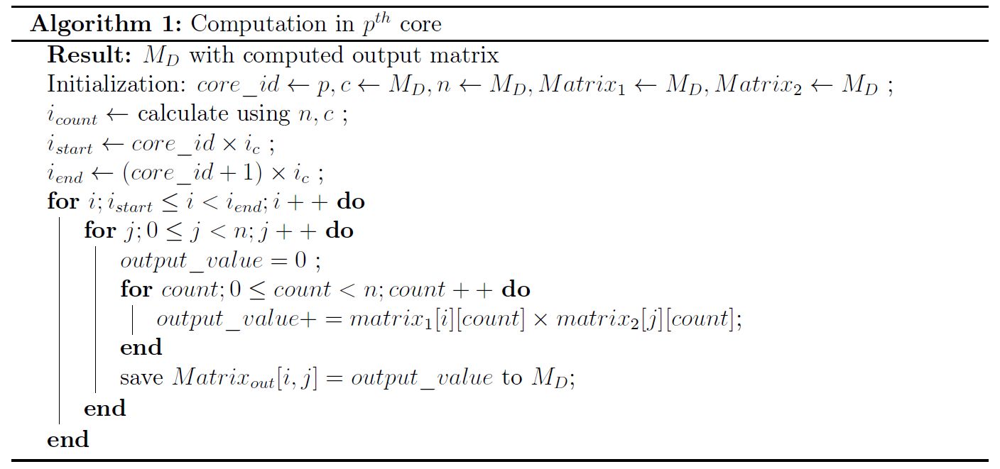
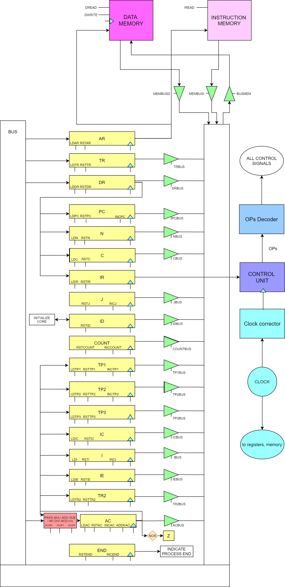
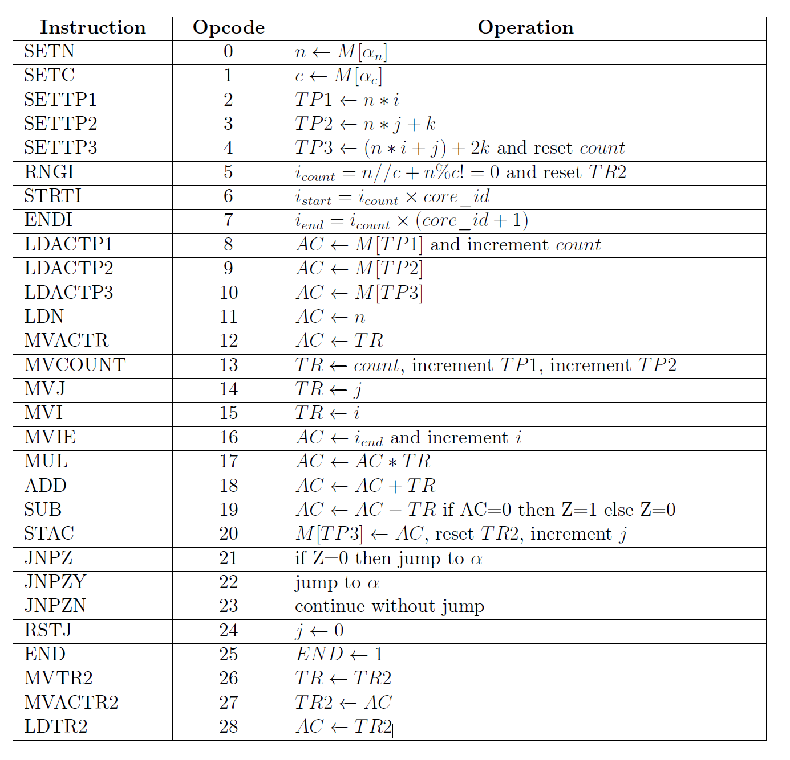
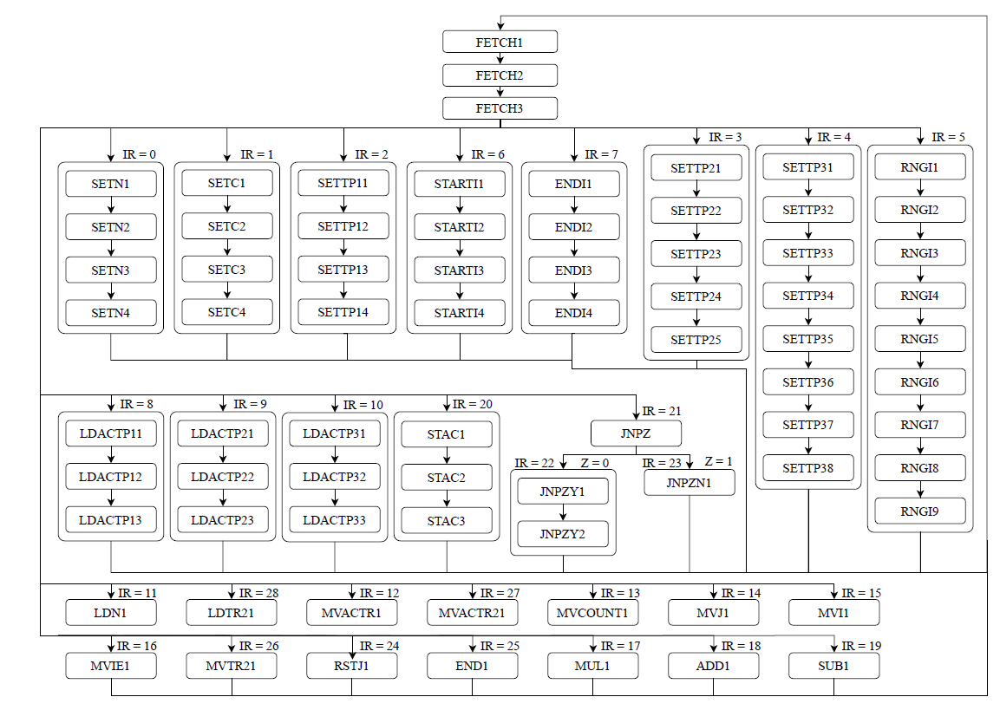
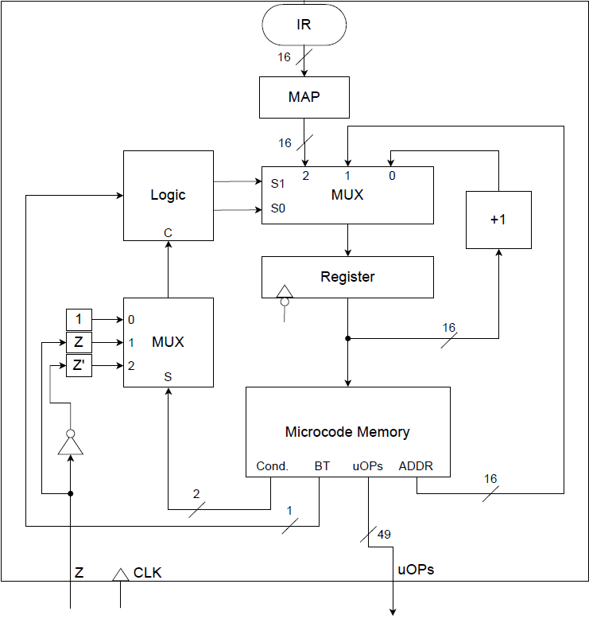
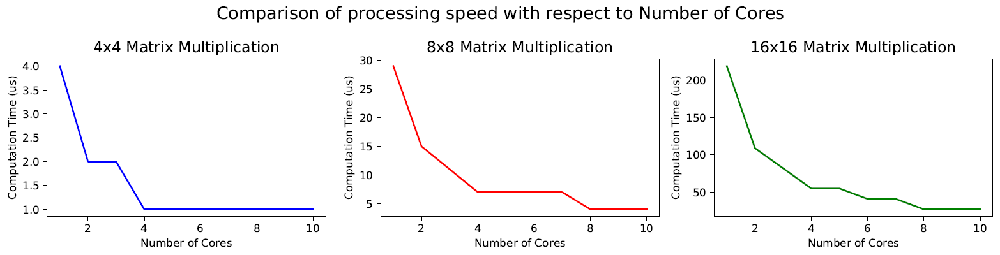

# Multi-Core Processor Design for Matrix Multiplication using FPGA

* Goal: Implement a simple processor that is capable of handling single instruction and multiple data processing in order to compute and output the results of a matrix multiplication. The processor is specifically designed and optimized to do matrix multiplication of square matrices of n x n. However, the proposed solution also facilitates the multiplication of matrices with different shapes.

* The proposed solution is implemented in Verilog Hardware Description Language using the QuartusLite 18.1.0.625.

## Algorithm

**Fig :** Algorithm

## Instruction Set Architecture (ISA)

##### Data Paths

**Fig :** Data Paths Diagram

##### Instruction Set

**Fig :** Instructions

##### State Diagram

**Fig :** State Diagram

### Control Unit

**Fig :** Control Unit

## Results and Conclusion
To this end, we have implemented and tested 10-core processor for paralleled matrix multiplication
with 16-bit valued data. Because of the independent processing of each core, the capability of adding more cores is straight forward. With the results shown in Fig. 34, it can be seen that the computation time for matrix multiplication is decreasing when increasing the number of cores for all matrix sizes. The implemented processor is capable of doing;

**Fig :** Results

* (4x4) 16-bit valued matrix multiplication within around 1 us utilizing 4 cores.
* (8x8) 16-bit valued matrix multiplication within around 4 us utilizing 8 cores.
* (16x16) 16-bit valued matrix multiplication within around 27 us utilizing 10 cores.

Even though initial reduction of computation time is significant, number of cores will no
longer be affected to the computation time when the number of cores passes the size of matrices.

